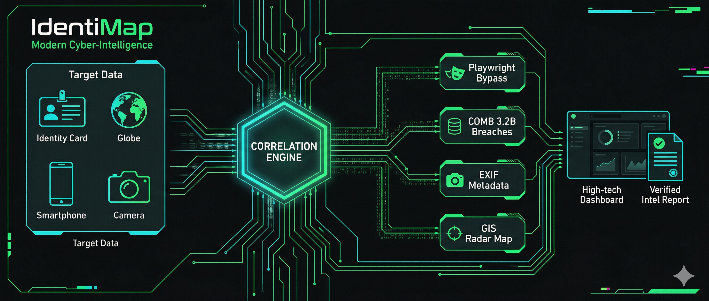

<div align="center">
  
  
  
  
</div>

<br />

<div align="center">
  <h1 align="center">🕵️‍♂️ IdentiMap OSINT Framework</h1>
  <p align="center">
    <strong>Advanced Digital Footprint Correlation Engine</strong>
    <br />
    <br />
    <a href="#about">About</a>
    ·
    <a href="#features">Features</a>
    ·
    <a href="#architecture">Architecture</a>
    ·
    <a href="#installation">Installation</a>
    ·
    <a href="#usage">Usage</a>
    ·
    <a href="#developer">Developer Credits</a>
  </p>
</div>

---

## 📌 About

**IdentiMap** is a high-performance Open-Source Intelligence (OSINT) framework built to correlate digital footprints across the web. Whether you start with a single username, an email, or a phone number, IdentiMap systematically traverses various endpoints to piece together the target's fragmented digital identity, automatically calculating an overarching **Confidence Score** for its findings.

Designed for both precision and speed, this framework provides both a **Classic CLI (Hacker-mode)** and a **Premium Web Dashboard** complete with dynamic visualizations and matrix-like aesthetics.

> **⚠️ Ethical Disclaimer:** This tool was aggressively designed for professional reconnaissance, educational purposes, and personal achievement. The developer is not responsible for any misuse. Always ensure you have authorization before performing OSINT operations.

---

## ✨ Features

- **🌐 Multi-Engine Architecture**: Operates on an abstract base engine model, allowing seamless horizontal scaling of new OSINT sources.
- **🛡️ Hybrid Bypass Mechanisms**: Employs rotating User-Agents, DuckDuckGo fallbacks, and **Playwright Headless Browsing** to bypass sophisticated WAF and bot protection.
- **✉️ Email Registration & Breach Engine**: Maps email registrations via `holehe` and cross-references them against **3.2 billion leaked records** using the COMB breach database.
- **📞 Telecom Analytics**: Parses intricate global phone metadata (provider, carrier location) and visualizes origin on a **Live Radar Map**.
- **🖼️ Photographic Intelligence**: Extracts hidden EXIF metadata (GPS, Camera specs) from image URLs and generates instant Reverse Image Search dorks.
- **🕸️ Node Graph Visualization**: Interactively maps the relationships between target identities, emails, and breaches using a force-directed graph.
- **📄 Intel PDF Reporting**: Generates professional, high-resolution intelligence dossiers available for instant download.
- **📈 Confidence Profiling**: Advanced correlation algorithm weighting each data point to render a probability index (Confidence Score %).

---

## 🏗️ Architecture

<div align="center">
  
</div>

The framework is decoupled into two critical stacks:

1. **Backend (Python / FastAPI / Typer)**
   - Responsible for raw data extraction.
   - Contains `/engines` containing discrete modules for Usernames, Phones, Emails, and Dorks.
   - Orchestrated via an asynchronous API layer (FastAPI) or parallelized CLI commands (Typer).
   - Powered by asynchronous processing (`holehe` + `asyncio`) for speed optimization.

2. **Frontend Dashboard (Next.js / TypeScript)**
   - Provides an intuitive UX for initiating scans and visualizing complex intelligence.
   - **Visualizers**: Integrated `React Leaflet` for geo-tracking and `Force Graph` for entity relationship mapping.
   - **Reporting**: Client-side PDF generation using `jsPDF` and `html2canvas`.
   - Employs responsive `Tailwind` grids and `Framer Motion` for scanning states.

---

## ⚙️ Installation

IdentiMap is split into two directories (`/backend` and `/frontend`). You must initialize both to fully utilize the Web Dashboard.

### Step 1: Initialize the API & Engines (Backend)
Ensure you have Python 3.9+ installed.

```bash
# Navigate to the backend directory
cd backend

# Create a virtual environment
python -m venv venv

# Activate the virtual environment
# On Linux/MacOS
source venv/bin/activate
# On Windows
venv\Scripts\activate

# Install core OSINT dependencies
pip install -r requirements.txt

# Install Playwright browser binaries
python -m playwright install chromium

# Start the correlation server on port 8000
python main.py
```

### Step 2: Initialize the Hacker Dashboard (Frontend)
Ensure you have Node.js 18+ and `npm` installed.

```bash
# Open a new terminal and navigate to the frontend directory
cd frontend

# Install UI packages (Tailwind, Framer Motion, Lucide)
npm install

# Build and start the development server
npm run dev
```

---

## 🚀 Usage

IdentiMap is designed to be highly versatile. You may interact with the engine via your preferred medium.

### Method A: Premium Web Interface
If you followed the installation steps above, both servers are running.
1. Open your browser to [http://localhost:3000](http://localhost:3000).
2. Input the target's vectors (e.g., *Real Name*, *Username(s)*, *Email*, *Phone Number*).
   *(Note: You must input at least ONE vector. Usernames can be comma-separated like: `johndoe, johnny123`)*
3. Click **START SEQUENCE**.
4. Observe the correlation algorithms outputting matched identities in real-time.

### Method B: The Command Line (CLI Mode)
If you prefer standard terminal reconnaissance output:

```bash
cd backend
python cli.py --name "Riska Aprilia" --username "ryria, riskaayamazaki" --email "test@example.com" --phone "+6283824038059"
```

The CLI supports the following arguments:
- `-u, --username` : Target usernames (comma-separated).
- `-p, --phone` : International phone number (inclusive of `+` country code).
- `-e, --email` : Email address to proxy into the holehe and breach engines.
- `-i, --image` : Direct URL to an image for EXIF extraction.
- `-d, --dob` : Date of birth.
- `-a, --address` : Real-world address strings for Dork generation.

---

## 👨‍💻 Developer Credits

This project was engineered and is passionately maintained by:

### **Ahmad dzakiudin**
A dedicated developer blurring the lines between standard application architecture and complex intelligence compilation algorithms. 

**Connect & Follow the Journey:**
- 📸 **Instagram**: [jakijekiiii](https://www.instagram.com/jakijekiiii)
- 👤 **Facebook**: [jakijekijuki](https://www.facebook.com/jakijekijuki)
- 🐙 **GitHub**: [Dzakiudin](https://github.com/Dzakiudin)

---

<p align="center">
  <i>"Hiding your digital footprints is an art. Finding them is a science."</i>
  <br>
  <b>— Ahmad dzakiudin (2026)</b>
</p>